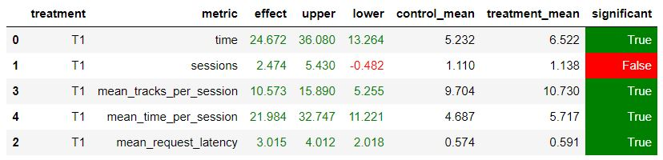

# Идея

1. Идея, давшая мне самый большой прирост по метрикам очень проста и основывается на рекомендере *Contextual*.
2. Запоминаем треки которые пользователь прослушал дольше 70% и используем их как "предыдущие", если трек прослушивался меньше 70%, то мы не будем его использовать.

# Результаты

